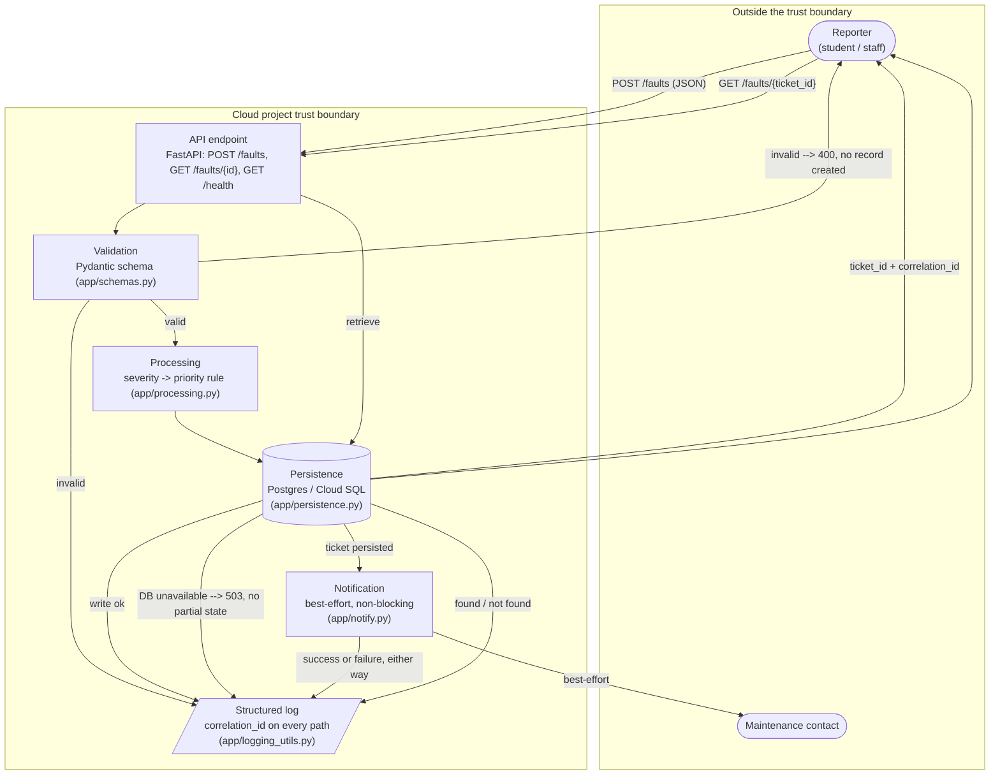

# Architecture Diagram — Fault Reporting Service

Annotated version of the Milestone 1 "Figure 1". Rendered with Mermaid
(GitHub, GitLab, and most Markdown previewers render this natively; for the
LMS Word/PDF submission, paste this block into the
[Mermaid Live Editor](https://mermaid.live) and export a PNG/SVG).

## Annotations

| Element | Role | Notes |
|---|---|---|
| Reporter | Event source, outside trust boundary | No authentication (explicit Milestone 1 exclusion) — anyone who can reach the endpoint can submit. Accepted risk for a course prototype; see [threat-checklist.md](threat-checklist.md). |
| Maintenance contact | Notification sink, outside trust boundary | Currently a stubbed no-op — no real external call is made, so no real data leaves the trust boundary yet. |
| API endpoint | Entry point inside the trust boundary | Maps to Cloud Run (or the local FastAPI/uvicorn process). No network access outside `docker-compose.yml`'s two services. |
| Validation | First-line defence | Rejects malformed input before any persistence or processing happens — satisfies **F2**. |
| Processing | The one real business rule | `severity -> priority` (high=P1, medium=P2, low=P3) — satisfies **F3**; not an echo of the input. |
| Persistence | Durable system of record | Postgres locally / in Docker, Cloud SQL when deployed — same SQLAlchemy models, only `DATABASE_URL` changes. This is the system of record, not a disposable cache — satisfies the Milestone 1 architecture note that persistent state "is not hidden inside a replaceable function." |
| Notification | Best-effort, explicitly non-blocking | A failure here is caught, logged, and does **not** fail the request or corrupt the persisted ticket — satisfies **Q3**'s "safe error, not corrupted state" for this dependency. |
| Structured log | Cross-cutting, every path | Every accepted/rejected/failed event writes one JSON line carrying `correlation_id`, satisfying **Q4**. In Cloud Run this stream is auto-ingested by Cloud Logging with zero extra wiring. |

## Trust boundary statement

Everything inside the trust boundary runs inside the team's cloud project
(or the local Docker network standing in for it). The reporter and the
maintenance contact are both untrusted with respect to this boundary: the
reporter's input is never trusted until validated, and the notification
channel's failure is never allowed to affect state inside the boundary.
