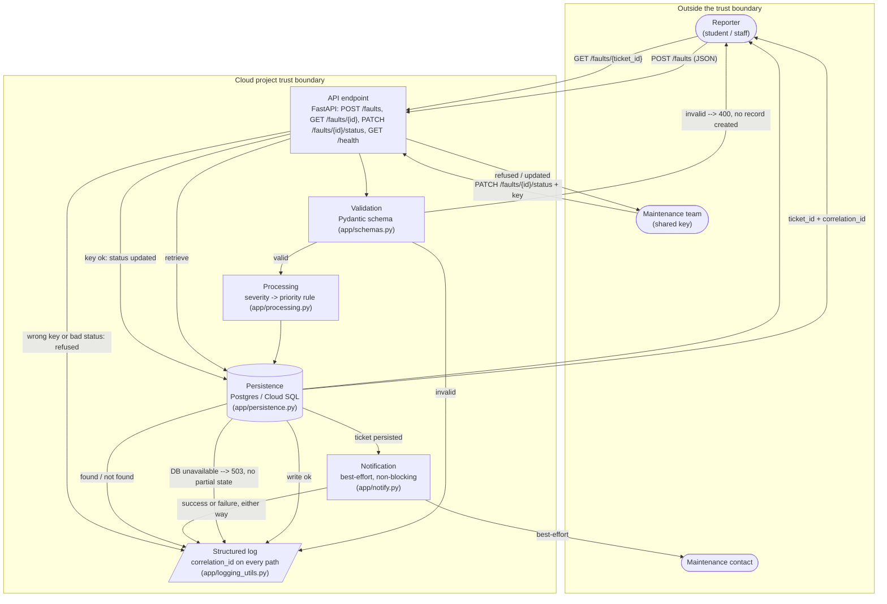

# Architecture Diagram — Fault Reporting Service

Annotated version of the Milestone 1 "Figure 1". Rendered with Mermaid
(GitHub, GitLab, and most Markdown previewers render this natively; for the
LMS Word/PDF submission, paste this block into the
[Mermaid Live Editor](https://mermaid.live) and export a PNG/SVG).

A rendered PNG with numbered arrows that match the Milestone 2 event-flow
table is in [diagrams/event-flow.png](diagrams/event-flow.png).

```mermaid
flowchart TB
    subgraph EXT["Outside the trust boundary"]
        Reporter(["Reporter\n(student / staff)"])
        MaintContact(["Maintenance contact"])
        MaintTeam(["Maintenance team\n(shared key)"])
    end

    subgraph TB["Cloud project trust boundary"]
        direction TB
        API["API endpoint\nFastAPI: POST /faults, GET /faults/{id}, PATCH /faults/{id}/status, GET /health"]
        Validate["Validation\nPydantic schema (app/schemas.py)"]
        Process["Processing\nseverity -> priority rule (app/processing.py)"]
        Persist[("Persistence\nPostgres / Cloud SQL\n(app/persistence.py)")]
        Notify["Notification\nbest-effort, non-blocking\n(app/notify.py)"]
        Log[/"Structured log\ncorrelation_id on every path\n(app/logging_utils.py)"/]
    end

    Reporter -- "POST /faults (JSON)" --> API
    API --> Validate
    Validate -- "invalid" --> Log
    Validate -- "invalid --> 400, no record created" --> Reporter
    Validate -- "valid" --> Process
    Process --> Persist
    Persist -- "write ok" --> Log
    Persist -- "DB unavailable --> 503, no partial state" --> Log
    Persist -->|"ticket persisted"| Notify
    Notify -- "best-effort" --> MaintContact
    Notify -- "success or failure, either way" --> Log
    Persist -- "ticket_id + correlation_id" --> Reporter
    Reporter -- "GET /faults/{ticket_id}" --> API
    API -- "retrieve" --> Persist
    Persist -- "found / not found" --> Log
    Persist --> Reporter
           MaintTeam -- "PATCH /faults/{id}/status + key" --> API
       API -- "key ok: status updated" --> Persist
       API -- "wrong key or bad status: refused" --> Log
       API -- "refused / updated" --> MaintTeam
```

## Annotations

Quick-reference notes per component (expanded into the full §5.2 annotation
chain — requirement → service role → trust boundary → input/output →
failure behaviour → permission → cost unit → evidence source — in the
table below):

| Element | Role | Notes |
|---|---|---|
| Reporter | Event source, outside trust boundary | No authentication (explicit Milestone 1 exclusion) — anyone who can reach the endpoint can submit. Accepted risk for a course prototype; see [threat-checklist.md](threat-checklist.md). |
| Maintenance contact | Notification sink, outside trust boundary | Currently a stubbed no-op — no real external call is made, so no real data leaves the trust boundary yet. |
| API endpoint | Entry point inside the trust boundary | Maps to Cloud Run (or the local FastAPI/uvicorn process). No network access outside `docker-compose.yml`'s two services. |
| Validation | First-line defence | Rejects malformed input before any persistence or processing happens — satisfies **F2**. |
| Processing | The one real business rule | `severity -> priority` (high=P1, medium=P2, low=P3) — satisfies **F3**; not an echo of the input. |
| Persistence | Durable system of record | Postgres locally / in Docker, Cloud SQL when deployed — same SQLAlchemy models, only `DATABASE_URL` changes. This is the system of record, not a disposable cache — satisfies the Milestone 1 architecture note that persistent state "is not hidden inside a replaceable function." |
| Notification | Best-effort, explicitly non-blocking | A failure here is caught, logged, and does **not** fail the request or corrupt the persisted ticket — satisfies **Q3**'s "safe error, not corrupted state" for this dependency. |
| Structured log | Cross-cutting, every path | Every accepted/rejected/failed event writes one JSON line carrying `correlation_id`, satisfying **Q4**. In Cloud Run this stream is auto-ingested by Cloud Logging with zero extra wiring. |
| Maintenance team | Actor outside the trust boundary who updates ticket status | Uses a shared key in the `X-Maintenance-Key` header (not per-user login) to move a ticket open → in progress → resolved. |

## Full component annotation (§5.2 required chain)

| Component | Requirement | Service role | Trust boundary | Input / output | Failure behaviour | Permission | Cost unit | Evidence source |
|---|---|---|---|---|---|---|---|---|
| API endpoint | F1, F2 | HTTP entry point (FastAPI/uvicorn; maps to Cloud Run) | Inside — first component a request touches | In: raw HTTP JSON. Out: `FaultReportOut` or a typed error body | Malformed/invalid body → `400`, own error shape (see [failure-table.md](failure-table.md) row 3–5) | None (`--allow-unauthenticated`) — explicit product exclusion, not oversight; see [threat-checklist.md](threat-checklist.md) | Cloud Run: per-request CPU/memory time, free tier covers this workload (see [cost-worksheet.md](cost-worksheet.md)) | `app/main.py`; [interface-contracts.md](interface-contracts.md) |
| Validation | F2 | Pydantic schema enforcement | Inside | In: parsed dict. Out: typed `FaultReportIn` or `ValidationError` | Bad field → `400` before any processing/persistence runs, no state created | N/A (in-process, no external identity) | $0 (in-process compute only, covered by API endpoint's cost unit) | `app/schemas.py`; [failure-table.md](failure-table.md) rows 3–4 |
| Processing | F3 | Business rule: severity → priority | Inside | In: validated report. Out: `ticket_id`, `priority` | N/A — pure function, cannot fail on valid input | N/A (in-process) | $0 (in-process compute) | `app/processing.py` |
| Persistence | F4, Q3 | Durable system of record (Postgres / Cloud SQL) | Inside | In: `Ticket` row. Out: same row on retrieval | DB unreachable → `503`, no partial write (see [failure-table.md](failure-table.md) row 1) | Runner service account granted `roles/cloudsql.client` only (least privilege; see `scripts/provision_gcp.sh`) | Cloud SQL instance-hours + storage — the dominant cost line, see [cost-worksheet.md](cost-worksheet.md) | `app/persistence.py`; `evidence/milestone3_evidence.md` §E1, E6 |
| Notification | Q3 | Best-effort maintenance alert — real webhook if `NOTIFY_WEBHOOK_URL` is set, zero-dependency stub otherwise | Inside (call originates here); crosses OUT to the maintenance contact when a real webhook is configured | In: `ticket_id`, `equipment_id`, `priority`. Out: `bool` success, or caught `NotificationError` | Failure caught and logged, never blocks or fails the request — verified against both a real HTTP success and a real HTTP 500 (see [failure-table.md](failure-table.md) row 2) | `NOTIFY_WEBHOOK_URL` read from the environment only, never committed or logged — same handling as `DATABASE_URL` | $0 with the default stub; a real channel's cost is external (webhook service or email API tier) | `app/notify.py`; `evidence/milestone3_evidence.md` §E7 and "Real notification channel evidence" |
| Structured log | Q4 | Cross-cutting observability | Inside | In: event name + fields. Out: one JSON line to stdout | N/A — logging itself is not a modelled failure point | Runner service account granted `roles/logging.logWriter` | Cloud Logging: free up to 50GiB/project/month, this workload is well under it | `app/logging_utils.py`; every row in `evidence/milestone3_evidence.md` |

## Trust boundary statement

Everything inside the trust boundary runs inside the team's cloud project
(or the local Docker network standing in for it). The reporter and the
maintenance contact are both untrusted with respect to this boundary: the
reporter's input is never trusted until validated, and the notification
channel's failure is never allowed to affect state inside the boundary.
